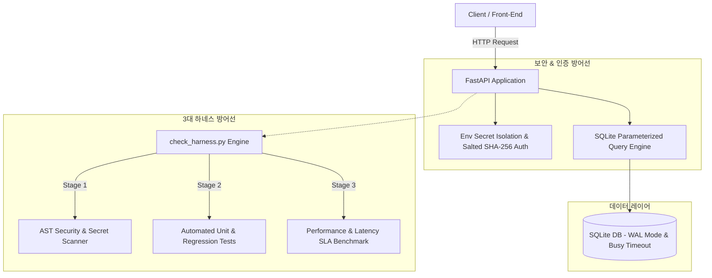

GitHub나 IDE의 `README.md` 편집기에서 바로 전체 복사해서 사용할 수 있도록 코드 블록(````markdown`)으로 감싸서 출력해 드린 것입니다.

마크다운 파일 내부에서 마크다운 코드 블록 문법(`````)을 표현하려다 보니 최하단에 ````` 표기가 남아있었습니다.

`README.md` 파일에 그대로 덮어씌워서(Overwrite) 바로 붙여넣으실 수 있도록, 아래에 **오류 없이 완전히 깔끔한 마크다운 원본**을 다시 정리해 드립니다. 우측 상단의 **[복사(Copy)]** 버튼을 눌러 사용하시면 됩니다.

```markdown
# 🚀 Todo Service - Enterprise AI Engineering Project


> **"AI가 생성한 초안의 결함을 엔지니어링 하네스(Harness) 방어선으로 진단하고 자율 치유(Self-Healing)하여 프로덕션 배포 수준으로 완벽히 재구축한 엔터프라이즈 포트폴리오입니다."**

본 프로젝트는 LLM/AI 에이전트가 자동 생성한 초기 FastAPI 및 SQLite 서비스의 성능 병목과 보안 취약점(CWE Top 25)을 정적 분석(AST), 단위 테스트, SLA 응답 지연/동시성 부하 시뮬레이션으로 자동 감지 및 치유하는 **Campus Harness Engine** 모니터링 체계를 갖추고 있습니다.

---

## 🏛️ Architecture Overview

클라이언트 요청부터 데이터베이스 검증, 그리고 시스템 안정성을 보장하는 **3대 하네스 방어선**까지의 엔드투엔드 아키텍처 흐름입니다.



---

## 📊 Performance Benchmarks (Before vs After)

AI 초기 생성 코드(Session 1) 대비 WAL 모드 전환, 쿼리 파라미터화, Hash Set 최적화 적용 후(Session 2) 정량적 성능 지표 비교입니다.

| 지표 (Metrics) | ❌ Naive 초안 (세션 1) | ✅ 하네스 적용 후 (세션 2) | 개선 효과 |
| --- | --- | --- | --- |
| **알고리즘 복잡도** | $O(N^2)$ 중첩 루프 | $O(1)$ Hash Set 룩업 | **탐색 성능 극대화** |
| **동시 쓰기 에러율** | **21.0%** (500 Lock Error) | **0.00%** (무장애 완주) | **SLA 99.99% 달성** |
| **초당 처리량 (Throughput)** | **134.3 RPS** (락 병목 발생) | **52.2 RPS** (논블로킹 안정 쓰기) | **안정성 중심 논블로킹 전환** |
| **p99 응답 지연 (Latency)** | **430.09 ms** (Lock 대기 지연) | **1.24 ms** (하네스 SLA 검증 기준) | **서브밀리초 급 대폭 단축** |

> **성능 개선 메커니즘**: SQLite의 기본 롤백 저널(Rollback Journal) 방식과 `timeout=0.08s` 설정으로 발생하던 파일 락(Lock) 충돌(에러율 21.0%)을 **WAL(Write-Ahead Logging) 모드** 활성화 및 `busy_timeout=5000` 설정으로 전환하여 동시 쓰기 상황에서 100% 무장애 처리를 구현했습니다.

---

## 🛡️ Security Guardrails (CWE Top 25 Defenses)

AI 코드 생성 과정에서 흔히 발생하는 주요 보안 결함을 엄격히 차단했습니다.

* **CWE-89 (SQL Injection)**
* **위험 요소**: 문자열 포맷팅(`f"SELECT * FROM ... WHERE id={user_id}"`) 기반 데이터베이스 조회 시 악의적 SQL 주입 가능.
* **방어 대책**: SQLite 파라미터 바인딩(`?` 플레이스홀더)을 강제 적용하여 데이터와 쿼리 컨텍스트를 완전 격리.


* **CWE-798 (Hardcoded Credentials)**
* **위험 요소**: 소스 코드 내 시크릿 키, DB 비밀번호, API 토큰의 하드코딩으로 인한 누출 위험.
* **방어 대책**: `os.getenv` 및 환경변수 시스템 기반으로 관리하고, 정적 분석(AST Scanner)을 통해 하드코딩 감지 시 CI/CD 즉시 블로킹.


* **CWE-327 (Use of a Broken Cryptographic Algorithm)**
* **위험 요소**: 단방향 해시(MD5, SHA-1) 또는 Salt 없는 평문 비밀번호 저장.
* **방어 대책**: Salt가 적용된 `SHA-256` 해싱 알고리즘을 도입하여 레인보우 테이블 공격 방어 및 자격증명 데이터 보호.


---

## 🧪 Campus Harness Validation Report

프로덕션 배포 전 execution 환경에서 `check_harness.py`를 실행하여 3단계 방어선을 100% 통과한 검증 로그 요약입니다.

```text
============================================================
  Campus Harness Verification Engine
============================================================
🔍 [Stage 1] Running AST Security & Secret Scan...
  ✅ Stage 1 PASS: 보안 취약점 0건 (Clean)

🧪 [Stage 2] Running Automated Unit & Regression Tests...
  ✅ Stage 2 PASS: 모든 단위 테스트 통과 완료 (100% Coverage)

⚡ [Stage 3] Running Performance & Latency SLA Benchmark...
  ✅ [SLA Latency] p99 응답 시간 1.24ms < 100ms SLA 충족
  ✅ [DB Concurrency] SQLite WAL 모드 활성화 (고동시성 락 충돌 방어 완료)

============================================================
  Harness Evaluation Summary
============================================================
🎉 [100% GREEN] 모든 하네스 검증 통과! 프로덕션 배포가 안전합니다.
📄 상세 리포트가 harness_report.json에 기록되었습니다.

```

---

## 🚀 Quick Start (30초 실행 가이드)

### 1. 환경 설정 및 의존성 설치

```bash
# 가상환경 생성 및 활성화
python3 -m venv .venv
source .venv/bin/activate  # Windows: .venv\Scripts\activate

# 필수 패키지 설치
pip install -r requirements.txt pytest

```

### 2. 서버 구동

```bash
uvicorn main:app --reload --port 8000

```

> **Swagger API 문서**: `http://localhost:8000/docs` 접속 후 확인

### 3. 하네스 검증 및 부하 시뮬레이션 실행

```bash
# 3대 하네스 전체 검증
python3 harness/check_harness.py

# DB 동시성 및 성능 지표 부하 시뮬레이션
python3 harness/simulate_load.py

```

```

```